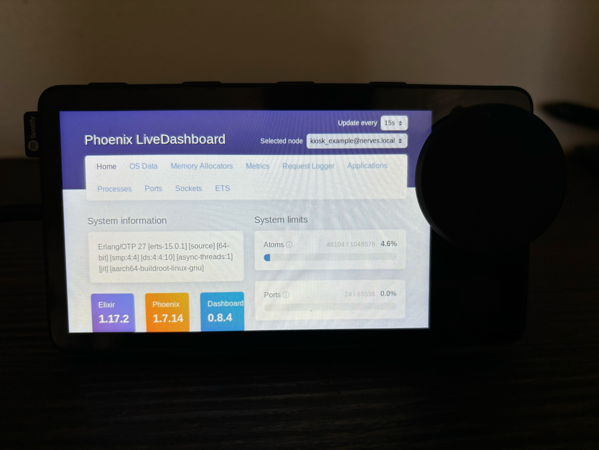
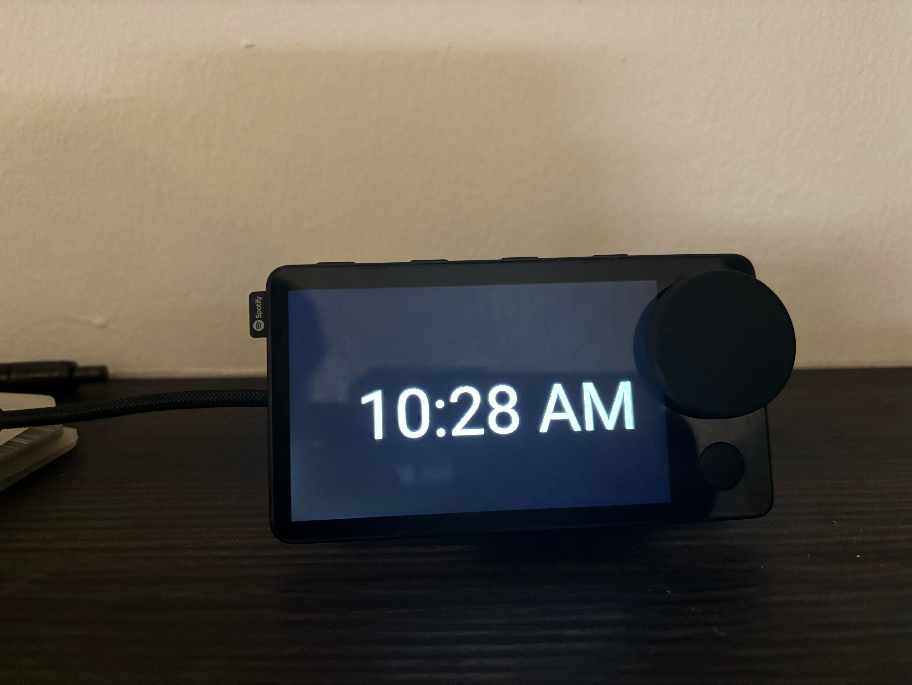

# Intro

**superbird** (Spotify&trade; Car Thing) should and could be a brilliant device with a compact package, good enough I/O and a soc better than Raspberry Pi 2 W (although without WiFi and ports). Please keep in mind that this is an embedded device, don't expect it to solve any complicated tasks! 

Anyway, if you still think this will become e-waste for you, **you can for sure support this project by sending it to [Alex Cao](https://github.com/alexcaoys) or me :)** 

> [!WARNING]
> TRY EVERYTHING BELOW AT YOUR OWN RISK!!! If you don't know what you are doing, STOP**.

**Kernel repo**: https://github.com/alexcaoys/linux-superbird-6.6.y

For notes on Alex's kernel tweaks as well as support matrix, please refer to [`BUILDING.md`](BUILDING.md).

# Project changes and intent

This forked repo is intended to be used for [`bootstrapping`](./bootstrapping.md) a Car Thing for use as an Elixir Nerves device. Future development will occur in
the [`Nerves superbird System`](https://github.com/ericr3r/nerves_system_superbird) or sample apps such as [`Superbird Clock`](https://github.com/ericr3r/nerves_system_superbird).

> [!NOTE]
> None of this would be possible without [Alex Cao's notes](https://github.com/alexcaoys/notes-superbird) and work. 

# TL;DR

**Beware of all the consequences and you can get started.**

